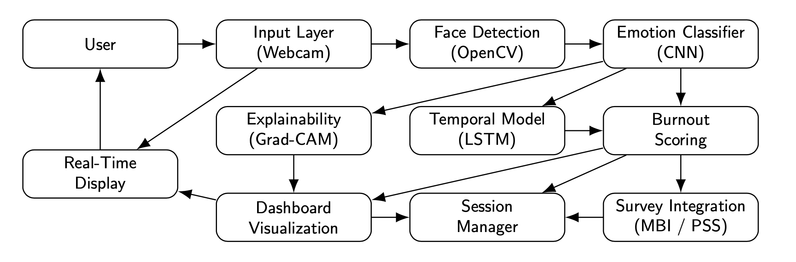
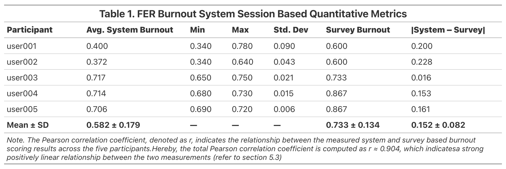
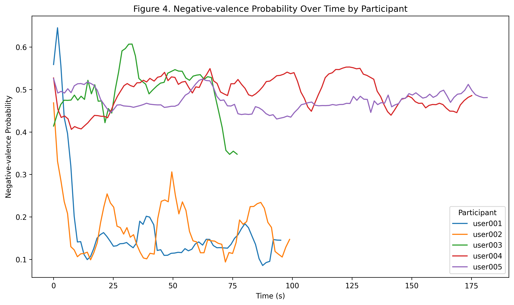

# 🫆 **FER Based Burnout Detection System – Real Time Stress and Burnout Predictor Through Facial Emotion Recognition System (FER) and Hybrid Deep Learning CNN/LSTM Models**

<div align="center">


</div>

---

## 💬 **1. Abstract**
Burnout and prolonged stress have become increasingly prevalent in academic and professional environments, negatively affecting cognitive performance, emotional well-being, and productivity. Conventional burnout assessment methods—most notably survey-based instruments such as the Maslach Burnout Inventory (MBI)—are widely validated but inherently limited by subjectivity, recall bias, and their inability to capture real-time emotional dynamics.

This project presents a **real-time, non-invasive burnout detection system** based on **Facial Emotion Recognition (FER)** and **temporal deep learning models**. The system integrates a convolutional neural network (CNN) for per-frame facial emotion classification with a Long Short-Term Memory (LSTM) network to model emotional persistence and variability across time. Emotion probabilities are transformed into an interpretable burnout score using a weighted emotional valence formulation combined with temporal volatility. The system implements an end-to-end pipeline that estimates a **burnout/stress proxy score** from real-time webcam streams by combining the listed modules:

- **Face detection + landmarks** (MTCNN-based localization + keypoints)
- **Facial emotion recognition (CNN)** producing an emotion probability vector
- **Geometric fatigue cues** from facial landmarks (lightweight features)
- **Temporal modeling (LSTM)** to capture gradual stress accumulation
- **Burnout scoring** via weighted emotion/landmark signals over time
- **Survey validation integration** (MBI / PSS-style alignment)
- **Explainability** using Grad-CAM and saliency visualizations
- **Session logging + longitudinal analysis** for multi-session trends

In order to validate the system, FER-derived burnout scores are statistically compared with standardized survey-based burnout scores (MBI/PSS) using Pearson’s correlation analysis. Experimental results demonstrate a **strong positive correlation (r ≈ 0.904)** between system-generated burnout scores and survey measurements, supporting the system’s reliability as a complementary, continuous burnout monitoring framework. Consequently, this project is specifically designed to be **computer-science oriented** (architecture + implementation + reproducibility), while still acknowledging the psychological grounding of burnout through its validation logic and longitudinal interpretation.

---

## 💡 **2. Motivation**
The system is designed as a **modular, end-to-end FER pipeline** that operates in real time using webcam input. Facial expressions are detected and classified into Ekman’s seven universal emotions (*Happy, Sad, Angry, Fear, Disgust, Surprise, Neutral*) using a pretrained CNN model. These emotion probabilities are then processed temporally using an LSTM to capture emotional persistence and instability—key indicators of prolonged stress.

Rather than treating burnout as an instantaneous state, this system models burnout as a **temporal psychological phenomenon**, where sustained negative emotional valence and high emotional volatility contribute to elevated burnout levels. The output is a continuous burnout score that can be visualized, logged, and compared against survey-based assessments across multiple sessions. As burnout and prolonged stress are not **instant** states due to its gradual emergence, its often represented as:
- Emotional flattening or instability,
- Reduced positive affect,
- Facial tension / fatigue cues,
- Temporal patterns that single-frame classification cannot reliably capture.

The majority of real-time vision camera-based systems stop at **emotion labels**, but burnout detection requires:

- **Continuous scoring**,  
- **Temporal modeling**, 
- **Validation against accepted instruments** (survey proxies).

As a result, this project is motivated by the following practical research question:

> Can we build a real-time FER system that produces a meaningful burnout/stress proxy,
> track it over sessions, and relate it to survey-based ground truth signals?

The system is **not intended as a clinical diagnostic tool**, but rather as a **research-driven, complementary framework** for continuous burnout monitoring and affective analysis.

## 📚 **3. Introduction and Core Concepts**
This system operates on three core representations:

### 🎭 **3.1. Emotion Probabilities (CNN FER)**
Instead of using **hard labels**, the pipeline focus on integrating the **full softmax vector** where:
- Classified Inputs: Ekman's Universal Emotions (Angry, Disgust, Fear, Happy, Neutral, Sad, Surprise)
- Expected output: $p ∈ R^7$, $Σ p_i = 1$

This is crucial as stress or burnout is often better reflected by its **distribution shifts** over time (e.g., increased negative affect probability mass, reduced positive affect, etc.)
rather than single predicted labels, given that the FER based emotional fluctuations is prone to a high degree of sensitivity and instantaneous changes.

### 📐 **3.2. Landmark-Derived Fatigue Features**
Facial landmarks provide lightweight fatigue indicators (examples):
- Eye openness / closure tendency,
- Mouth openness / tension cues,
- Normalized geometric ratios for stability across distance.

These cues do not directly **diagnose** burnout medically. However, they act as a **support signal** that helps the score reflect fatigue-like expressions especially within prolonged LSTM based measurements.

### 🧠 **3.3. Temporal Modeling (LSTM)**
Burnout is modeled as **time-dependent**. Each timestep forms a feature vector:

$$x_t = [\tt{emotion\_probs} (7) + \tt{landmark\_features}(\approx3)] \rightarrow [\approx10 dims]$$

Sequences (e.g., 30 frames) are passed to an LSTM to estimate near-future burnout trajectory:

- smoother scoring,
- less frame-to-frame noise,
- captures accumulation patterns.

---

## 🏗️ **4. System Architecture**
Below is the high-level architecture (Referenced from my thesis presentation):

<div align="center">



</div>

### 🔩 **4.1. Runtime Flow**
In accordance to the figure shown above, the project follows the specified architecture processes where:
1. Capture webcam frame (OpenCV)
2. Detect face + landmarks (MTCNN)
3. Crop face ROI safely
4. CNN FER → emotion probability vector
5. Landmark feature extraction → geometric fatigue cues
6. Burnout scoring update (rolling window)
7. LSTM temporal prediction (optional)
8. Dashboard overlay (live)
9. Save session outputs (CSV) + survey entry
10. Correlation + longitudinal trend analysis (post-session)

---

## 🎄 **5. Project Structure**
The FER's burnout detector repository is structured as a modular project layout consisting of the core implementations such as the user's real time facial detector, the emotion based recognition and its CNN/LSTM-based architectures:
```graphql
burnout_thesis_project/
├── main.py                         # Single-user real-time system entrypoint
├── main_multi_user.py              # Multi-user real-time mode (if enabled)
├── main_multi_user_record.py       # Multi-user mode with recording
│
├── face_detection.py               # Face localization + landmarks + geometric features
├── emotion_recognition.py          # CNN FER inference wrapper (emo0_1.h5)
├── burnout_scoring.py              # Burnout proxy scoring logic + rolling aggregation
├── lstm_burnout_predictor.py       # Temporal modeling (sequence → predicted trend)
│
├── dashboard.py                    # Live visualization overlay + plots + session buffers
├── session_manager.py              # Session persistence + metrics export
├── longitudinal_analysis.py        # Cross-session trend visualization + aggregation
├── analysis.py                     # Correlation & statistical utilities
│
├── survey_integration.py           # Survey collection + storage (MBI/PSS alignment)
├── explainability.py               # Grad-CAM + saliency generation for interpretability
│
├── data_processing/                # Diagrams and figures used for the thesis
├── test/                           # Modules for benchmark and test runs
├── data_sessions/                  # Session CSVs + metrics + survey logs 
├── recorded_videos/                # Stored AVI/MP4 recordings
├── README.md 
└── LICENSE
```

## 📦 **6. Datasets and Experimental Sources**
This thesis project does not rely solely on a single dataset, where it's propagated with the following specifications:

---

### 💾 **6.1. Primary dataset**
- Emo0.1 (CNN model weights `emo0_1.h5` / `Emo0.1.h5 lineage`)

---

### 🫆 **6.2. Supplementary datasets**
- CK+ for controlled expression references
- Custom recordings (real webcam sessions under practical conditions)

This mixed approach is intended to reduce overfitting to a single benchmark setting and increase realism in webcam deployment scenarios, especially during the deployment of the FER based system where each frame matters.

## 🧪 **7. Outputs and Log Operationalizations**
The system generates structured outputs so the thesis can report both frame-level and session-level evidence.

---

### 📄 **7.1. Frame-Level Logs (High Granularity)**
A typical session produces a CSV containing (conceptually):
- Timestamp / frame index
- Detected emotion label (optional)
- Emotion probabilities (7 columns)
- Landmark features (k columns)
- Burnout score per timestep
- Optional predicted burnout trend

In which, these frame-level logs has an applicability to create:
- Time-series plots (burnout vs time)
- Emotion distribution shifts
- Stability analysis (variance / smoothing)
- Qualitative case studies

---

### 🥼 **7.2. Session Metrics (Low Granularity)**
A session also produces a compact metrics CSV summarizing:
- Max / min / average burnout score
- Number of valid frames
- Session start time
- Per-user identifiers

In which, these frame-level logs has an applicability to create:
- Summarizing experiments across multiple runs
- Reporting aggregate statistics
- Comparing conditions (rested vs fatigued, etc.)

---

### 🧾 **7.3. Survey Logs (Validation Proxy)**
The survey integration stores the following data or records:
- User responses per session
- Computed survey score / category mapping
- Used later for correlation analysis with the burnout proxy score


## 🧮 **8. Mathematical Formulations**
This section summarizes the core mathematical formulations utilized within the development and deployment of the system in accordance to the psychological framework with Eukman's primary emotion classifications and its validation through the MBI survey based results. 

---

### ❤️ **8.1. Emotion Probability Distribution**
For each detected facial frame, the CNN classifier outputs a probability distribution over Ekman’s emotion classes using a softmax function:

$$
P(e_i \mid x) = \frac{e^{z_i}}{\sum_{k=1}^{K} e^{z_k}}
$$

Where:
- $x$ is the input facial image,
- $z_i$ is the logit for emotion class $i$,
- $K = 7$ is the number of emotion classes.

---

### 🗄️ **8.2. Weighted Emotional Valence (Burnout Component)**
Burnout is first approximated through **weighted emotional valence**, where negative emotions contribute positively to burnout, while positive emotions act as buffers.

Let:
- \(N = \{\text{Sad, Angry, Fear, Disgust}\}\)
- \(P = \{\text{Happy}\}\)
- Baseline emotions: \(\{\text{Neutral, Surprise}\}\)

The session-level burnout score is defined as:

$$
S_{\text{burnout}} =
\frac{1}{T} \sum_{t=1}^{T}
\left(
\alpha \sum_{e_i \in N} P_t(e_i)
-
\beta \sum_{e_j \in P} P_t(e_j)
+
\gamma \sum_{e_k \in \text{Baseline}} P_t(e_k)
\right)
$$

Where:
- $T$ is the number of frames in the session,
- $\alpha, \beta, \gamma$ are tunable weights for negative, positive, and baseline emotions respectively.

---

### 📈 **8.3. Temporal Variability (Emotional Volatility)**
In order to capture emotional instability across time, temporal variability is defined as:

$$
V = \frac{1}{T} \sum_{t=1}^{T} (S_t - \bar{S})^2
$$

Where:
- $S_t$ is the frame-level burnout score,
- $\bar{S}$ is the mean burnout score across the session.

Higher variability reflects greater emotional dysregulation.

---

### 🔎 **8.4. Final Burnout Score**
The final burnout score integrates emotional valence and volatility:

$$
S_{\text{final}} = \lambda \cdot S_{\text{burnout}} + (1 - \lambda) \cdot V
$$

Where:
- $\lambda \in [0,1]$ balances sustained emotional valence and variability.

---

### 📊 **8.5. Statistical Validation (Pearson Correlation)**
In order to validate system outputs, FER-based burnout scores are compared with standardized MBI survey scores using Pearson’s correlation coefficient:

$$
r =
\frac{\sum_{i=1}^{n} (X_i - \bar{X})(Y_i - \bar{Y})}
{\sqrt{\sum_{i=1}^{n}(X_i - \bar{X})^2}
\sqrt{\sum_{i=1}^{n}(Y_i - \bar{Y})^2}}
$$

Where:
- $X_i$ = FER-derived burnout score for session $i$,
- $Y_i$ = MBI-derived burnout score for session $i$.

---

## 🧮 **9. Results and Quantitative Evaluation**
The experiments were conducted with 5 participants under controlled conditions. Key results include:

- **FER system burnout score range:** 37.2% – 71.7%  
- **MBI survey burnout score range:** 60.0% – 86.7%  
- **Mean absolute difference:** ≈ 15.2%  
- **Pearson correlation coefficient:** **r ≈ 0.904**

Below is the complete overview of the processed burnout scores and its statistical results:

<div align="center">



</div>

Additional observations further demonstrates thae following primary findings:
- LSTM temporal modeling significantly improves score stability compared to frame-based aggregation.
- Participants with sustained negative emotional persistence exhibit consistently higher burnout scores.
- Participants with stronger positive emotional valence show early fluctuations followed by stabilization.

These results confirm strong alignment between the system-derived burnout measurements and validated psychological assessments, supporting the system’s reliability and interpretability. Given that the **negative-valence time series** graph demonstrate this trend coherently as shown below:

<div align="center">



</div>


## 🏆 **10. Research Conclusion and Modular Behavior**
### 🏠 **10.1. Real-Time Pipeline Feasibility**
- Stable end-to-end execution (Webcam → overlay)
- Emotion inference works continuously in real time (Hardware dependent)
- Burnout score updates continuously using rolling aggregation

---

### ⛩️ **10.2. Temporal Behavior**
- Burnout score becomes more meaningful when analyzed as a trend
- Less sensitive to one-off emotion spikes
- Better reflects prolonged negative affect patterns
- LSTM component supports “next-step burnout” estimation (Sequence-aware smoothing)

---

### 🎛️ **10.3. Survey Alignment**
- Survey scores provide a practical thesis anchor:
- Burnout proxy is not treated as a clinical diagnosis
- Instead it is interpreted as a measurable behavioral signal

---

### 📫 **10.4. Explainability**
- Grad-CAM / saliency is used to:
- Demonstrate model attention regions,
- Provide visual interpretability for predicted emotion cues,
- Strengthen thesis credibility by showing why the CNN predicts certain classes.

## ⚙️ **11. Installation and Environment Setup**
### 🏮 **11.1. Python Specifications**
The recommended Python version to run this program is for 3.9+. A sample setup in a local env is shown below:
```bash
source burnout_env/bin/activate
python --version
```

---

### 📢 **11.2. Install Dependencies**
```bash
pip install -r requirements.txt
```

---

### 🧠 **11.3. Models**
Make sure to include the `emo0_1.h5` dataset. If a different dataset is utilized, please ensure there are no mismatches as the CNN is aggregated with Eukman's universal emotions. Adjust the weight parameters for optimal performance.


## ▶️ **12. Running the System**
### 🎥 **12.1. Single-User Real-Time Demo**
```bash
python main.py
```
> Press q to exit the session window

---

### 👥 **12.2. Multi-User Mode**
```bash
python main_multi_user.py
```

---

### 🚧 **12.3. Multi-User Recording**
```bash
python main_multi_user_record.py
```

## 🚦 **13. Reproducibility Notes**
In order to maintain consistent runs across various session and devices, ensure the following guidelines:
- Fix webcam resolution (Optional)
- Maintain consistent lighting (Crucial for FER stability)
- Avoid background CPU-heavy apps during real-time inference
- Log multiple sessions per user and evaluate trends (not single snapshots)

## 🧱 **14. Limitations**
This thesis project is a research based framework that is not interconnected to any available adavanced medical datasets or tools. Despite its consistency, several primary limitations were observed throughout the development and data collection processes listed as the following:
- Webcam FER is sensitive to lighting, occlusion, camera angle
- Emotion labels are coarse proxies for internal states
- Burnout is not directly observable as it must be inferred indirectly
- Dataset and domain potential mismatch is unavoidable (benchmark vs real webcam)
- LSTM quality depends heavily on sequence stability and feature quality

## 🛣️ **15. Future Work and Roadmaps**
Despite the robustness and cosistency of the FER based system in detection the burnout in real-time, there are several considerations in which this specific roadmap reflects such potential features to either increase the practical robustness or extend its theoretical and experimental applicability. In addition, this section outlines intentional future directions to enhance the project, such as:
- Optimize for higher FPS (GPU inference / batching / faster detectors)
- Improve any landmark features or utilize face mesh models
- Include diverse datastes (Race, Culture, Age, Gender)
- Strengthen temporal modeling (Transformer, TCN)
- Integrate personalized calibration per user
- Improve survey protocol and longitudinal validation design

## 📌 **16. Thesis and Presentation Slides**
The thesis slides is readily available in the following directory `docs/Thesis_Presentation_Slides.pdf`. In contrast, the finalized thesis paper is not available for public view due to academical and security issues. However, in cases where the thesis paper is crucial for research or annotations, please contact via GitHub or Email.

## 👤 **17. Author and Credentials**
This project is fully established and contributed by the following author and co-authors:
- **Name:** Rizky Johan Saputra
- **Thesis Advisor:** Prof. Chang-Gun Lee
- **Thesis Title:** The Application of Facial Emotion Recognition (FER) in the Detection and Measurement of Burnout and Prolonged Stress Levels
- **Department:** Computer Science and Engineering
- **Affiliation:** Undergraduate at Seoul National University (Enrolled at 2021, Graduated in 2026)
- **Role:** Thesis Researcher, Project Developer, Manager and Author 
- **Project Scope:** Computer Vision, Machine Learning, Deep Learning, Computer Architecture and Real-Time Systems.

## 📜 **18. License**
This repository is distributed under a Personal License tailored by the author and its affiliated instituion. See LICENSE for the full terms. For further inquiries and requests, please contact via GitHub or Email only.
> If you intend to reuse significant portions for research and academia purposes, please open and inquire an issue to discuss attribution and terms.

---

# <p align="center"><b>🎚️ Burnout emerges not in moments but rather in patterns. ⏱️ </b></p>
